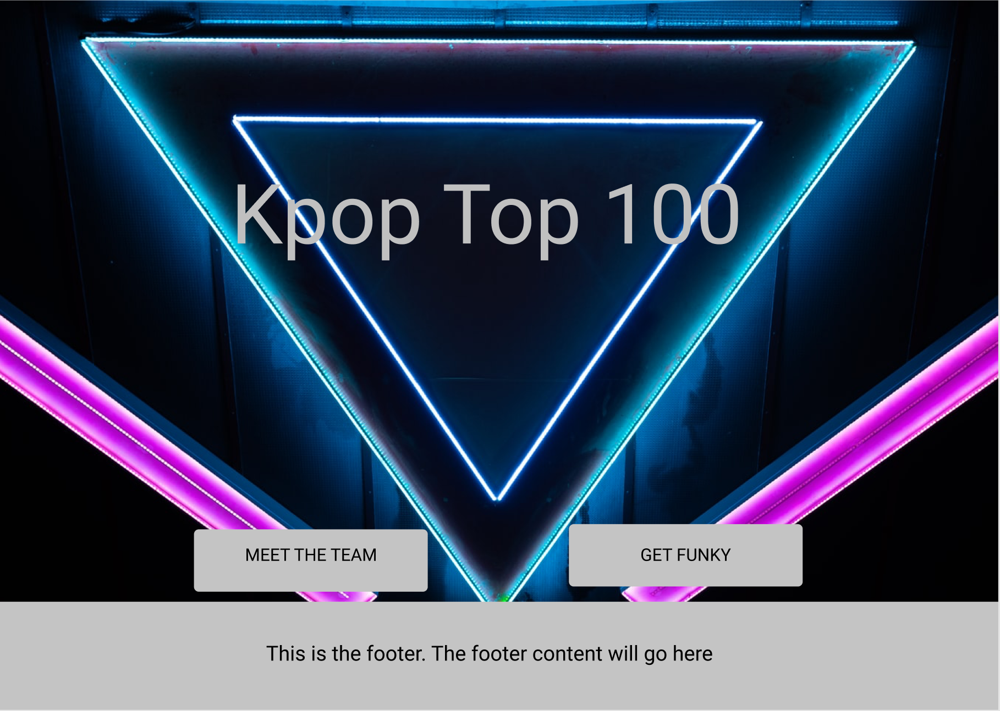
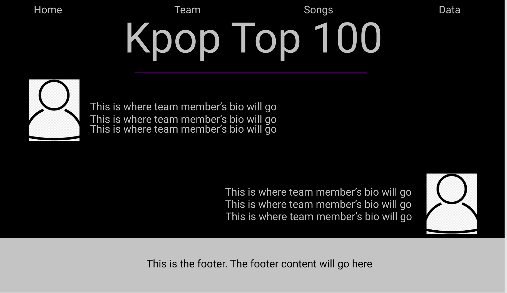
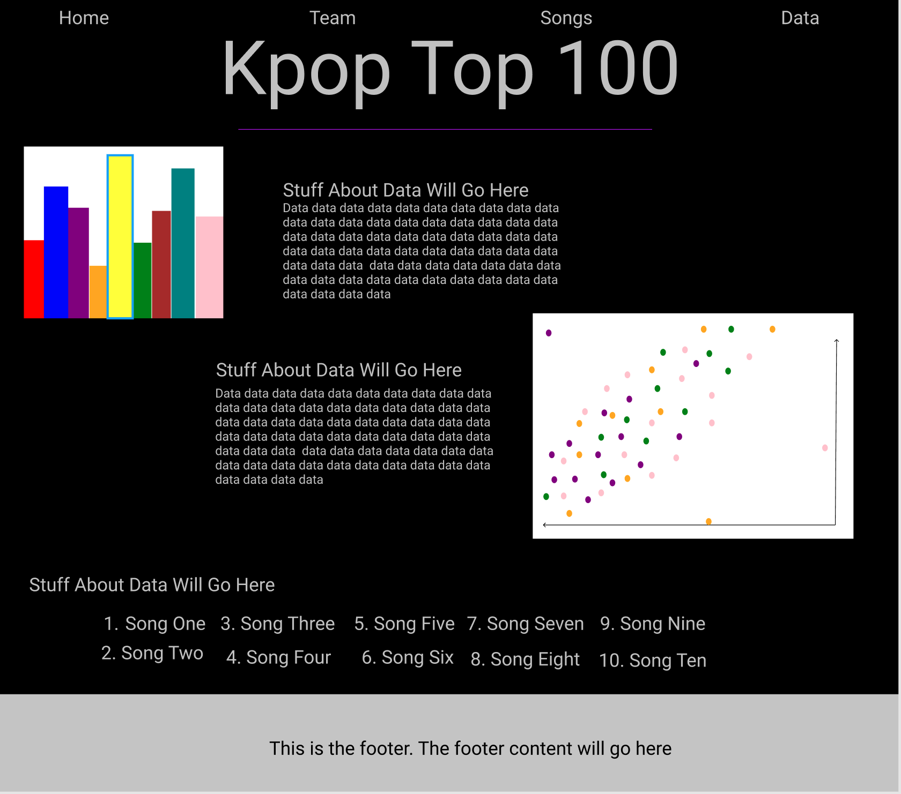

# kpop-top-100

## Inspiration

Korean Popular Music, or K-pop, really began to flourish in the 1990s. The final decade of the Twentieth Century closed on a high note with K-pop unveiling a new formula for discography that would keep the fans wanting more.
After borrowing elements from other well established genres like Hip Hop and Rap, Korean artists combined catchy beats with angsty rhymes to capture the hearts of South Korea's youth. To take things a step further, these tracks were accompanied by stylized choreography, visually appealing music videos, and perfect live performances.

Though the First and Second Generations of K-pop were the more nostalgic and unprecedented of the generations, this website will focus on the Third Generation. This content covers music released from 2010-2019. The reason being that this is the decade more American audiences may refer to as "throwback" since it is most likely when they began tuning into the globe sweeping phenomenon.

The purpose of this application is to create a list of the top ten most listened to K-pop songs of the last decade. In addition, users will be exposed to almost 1000 popular K-pop songs of the time. If you are looking to get sucked into the rapidly growing world of K-pop, this is the place to start.

## User Story
As a user, I want to understand the hype surrounding K-pop so that I can become a fan of the new genre. 

[Click here](https://kpop-top-100.herokuapp.com/) to visit the live website.

## Design

K-pop fashion is constantly evolving! One of the groups famous for changing with the trends is a group called f(X). The design for this website was based off two of their biggest hits: 
* Electric Shock

and

* Four Walls

This website's design focuses on the bold neon color pallete used in the Electric Shock music video, but also incorporates the crisp and clean lines that came during the abstract 70s inspired stage performances of their song Four Walls.

Though the website's appearance is simple, it packs just enough punch to keep the user on the application.

The focus should be the music. So I think the design should take a backseat to the main purpose of this application.

## Team

This website was created by Ashley Ikeh and Michael Ejike. Ashley is a full-stack web developer, who loves listening to K-pop and speaks some Korean. When this team of UGA alumnae embarked on this passion project, Ashley was the only  K-pop enthusiast on the team. Now, we're proud to say Michael found himself jamming to the playlists while collecting song titles and group names for the data analysis. 

>> "This was such a fun website. I remember smiling while coding because I got to build something that was so nostalgic for me." -Ashley

Michael is a certified data analyst who enjoys all things Atlanta Falcons related. No matter how much they lose, that's his team and he'll stick beside them. Visit Ashley's Github to view the code for this poject. Connect with us on LinkedIn if you have questions or would like to get involved on taking this project to the next level. 

## Songs

## Data

## Sources
* [Moritz Mentges](https://unsplash.com/photos/2RLRbRkWtpc)
* [Footer Placement](https://stackoverflow.com/questions/18739937/how-to-keep-footer-at-bottom-of-screen)
* [A Brief History of K-pop](https://www.lafilm.edu/blog/a-brief-history-of-kpop/)
